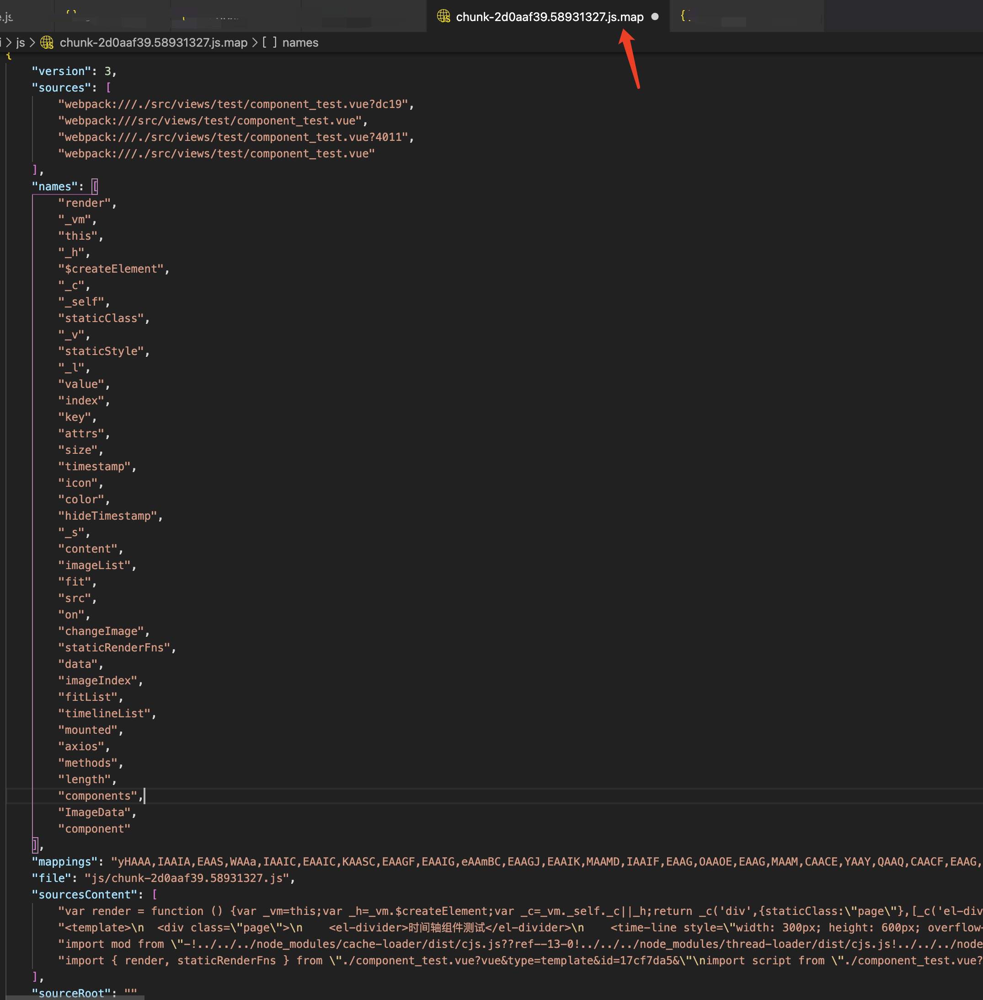

# webpack学习第四阶段

| 文档创建人 | 创建日期   | 文档内容                                      | 更新时间   |
| ---------- | ---------- | --------------------------------------------- | ---------- |
| adsionli   | 2021-11-11 | webpack学习第四阶段-webpack参数介绍与配置内容 | 2021-11-11 |

## ouput设置

1. `path`参数

   `output`中的`path`参数的设置，决定了我们打包之后将打包文件输出到什么位置。

2. `publicPath`参数

   `output`中的`publicPath`参数的设置，决定了index.html里面引入js文件的地址。同时也代表这些静态资源的路径。

   资源服务器上使用：==域名+pulicPath+filename==就可以获取到指定的资源文件。

   ```js
   'http://localhost' + publicPath ? '/' : publicPath + filename('js/main.js');
   ```

   > `publicPath`参数需要对本地静态资源加载及dev-server服务器加载进行区分
   >
   > 如果是本地静态资源加载的话，`publicPath`需要设置如下配置:
   >
   > ```js
   > publicPath: './'
   > ```
   >
   > 这里就需要给予相对路径。
   >
   > 如果是dev-server的话，`publicPath`需要设置如下配置:
   >
   > ```js
   > publicPath: '/'
   > ```
   >
   > 这里就需要给予绝对路径

## devServer配置

> 官方给出的devServer配置的详细说明： [devServer配置](https://webpack.docschina.org/configuration/dev-server/)

1. `publicPath`参数

   `devServer`中的`publicPath`参数相当于指定了webpack项目运行在`devServer`中时，由于打包内容是放在内存中的，那么也可以给定其在内存中的一个目录地址，来让其在浏览器中输入其相应的`publicPath`指定的地址。

   ```js
   'http://localhost' + devServer.publicPath ? '/' : devServer.publicPath + output.filename('js/main.js');
   ```

   不过这样设置后，引入的文件地址也需要修改，因为它被放在了内存的目录下，那么`output`中`publicPath`参数也得保持和devServer中的`publicPath`相同，这样才能引用到输入文件。

   > 这也只是在使用`devServer`服务的时候，如果是本地的静态资源打包，`output`下的`publicPath`就不需要和`devServer`中的`publicPath`保持一致了。

   ```js
   output: {
       filename: 'index.js',
       path: path.resolve(__dirname, 'dist'),
       publicPath: 'adsionli'
   },
   devServer: {
       hot: true,
       publicPath: 'adsionli'
   }
   ```

   ==注:比较新的webpack中已经废除了publicPath这个参数，现在需要通过设置static来实现以前的publicPath的功能，static的描述更加准确，就是静态资源==

2. `contentBase`参数

   > 打包的资源依赖了其他的资源，但是这个资源是不经过webpack打包处理的，那我们应该通过配置contentBase去找需要的这个资源路径

   contentBase的使用场景就是，当我们有一个文件或多个文件，不想通过webpack打包，那如果我们还是需要使用这块内容，那么我们就需要通过配置contentBase来找到这个资源的位置。

   具体配置如下(假设我们在public目录下有一个utils文件需要被使用，但是不希望通过webpack打包)

   ```js
   module.exports = {
       devServer: {
           hot: true,
           publicPath: '/adsionli/file',
           contentBase: path.resolve(__dirname, 'public')
       }
   }
   ```

   上述配置就可以导入这个资源，但是，当我们处在开发环境中时，以上配置是无法进行监听引入资源热更新的，这时候还需要配置`watchContentBase`参数

   ```js
   module.exports = {
       devServer: {
           hot: true,
           publicPath: '/adsionli/file',
           contentBase: path.resolve(__dirname, 'public'),
           //默认为false，需要自己开启
           watchContentBase: true
       }
   }
   ```

   这样后，虽然外部资源没有经过打包，但是依然可以通过dev-server服务器实现热更新

3. `hotOnly`

   在稍早版本的webpack5的版本中，如果当一个模块出现错误，且devServer中的`hot`参数为`true`，那么当修正了错误后，整个页面都会进行刷新，如果只希望对局部内容进行刷新的话，就还需要设置一个`hotOnly`的参数。

   ```js
   module.exports = {
       devServer: {
           hot: true,
           hotOnly: true,
           publicPath: '/adsionli/file',
           contentBase: path.resolve(__dirname, 'public'),
           //默认为false，需要自己开启
           watchContentBase: true
       }
   }
   ```

   按照上述配置了`hotOnly`参数之后，就可以完成对错误模块的热更新而不会去刷新整个页面了。

   在新的webpack5的版本中，`hotOnly`属性被删除了，合并成了`hot`属性里的一个可选项了，这时候只需要配置`hot`就可以了。

   ```js
   module.exports = {
       devServer: {
           hot: only,
           publicPath: '/adsionli/file',
           contentBase: path.resolve(__dirname, 'public'),
           //默认为false，需要自己开启
           watchContentBase: true
       }
   }
   ```

4. `port`参数

   `port`参数就是devServer运行端口的设置。

   ```js
   module.exports = {
       devServer: {
           hot: only,
           port: 8888,
           publicPath: '/adsionli/file',
           contentBase: path.resolve(__dirname, 'public'),
           //默认为false，需要自己开启
           watchContentBase: true
       }
   }
   ```

   devServer会根据配置的端口号，运行在本机的指定端口下，默认端口为8080，当被占用时，就会自动往下查找，直到找到一个没被使用的端口号。

5. `open`属性

   `open`属性就是当启动或热更新devServer之后，如果设置为true，就会在启动时自动打开系统设置的默认浏览器，如果为false，就不会自动打开浏览器。

   ```js
   module.exports = {
       devServer: {
           hot: only,
           port: 8888,
           open: false,
           publicPath: '/adsionli/file',
           contentBase: path.resolve(__dirname, 'public'),
           //默认为false，需要自己开启
           watchContentBase: true
       }
   }
   ```

6. `compress`属性

   `compress`属性能够控制content-encoding，如果`compress`属性设置为true，那么服务器就会使`content-encoding: gzip`，这样可以提高浏览器加载效率。如果为false,就不会进行处理。

   ```js
   module.exports = {
       devServer: {
           hot: only,
           port: 8888,
           open: false,
           publicPath: '/adsionli/file',
           contentBase: path.resolve(__dirname, 'public'),
           //默认为false，需要自己开启
           watchContentBase: true,
           compress: true
       }
   }
   ```

7. `historyApiFallback`属性

   > `historyApiFallback`属性按照官方的解释为:
   >
   > When using the [HTML5 History API](https://developer.mozilla.org/en-US/docs/Web/API/History), the `index.html` page will likely have to be served in place of any `404` responses. Enable `devServer.historyApiFallback` by setting it to `true`
   >
   > 翻译过来就是，当我们使用hha时，如果页面是一个404的请求，这时又开启了`historyApiFallback`，那么就会跳回index.html，在index.html去寻找对应的路由，这也就是像vue，react中，路由访问的时候，实际一开始是无法找到地址，而是在`historyApiFallback`开启的作用跳回了index.html，再有Router去处理跳转对应的路由的。

   ```js
   module.exports = {
       devServer: {
           hot: only,
           port: 8888,
           open: false,
           publicPath: '/adsionli/file',
           contentBase: path.resolve(__dirname, 'public'),
           //默认为false，需要自己开启
           watchContentBase: true,
           compress: true,
           historyApiFallback: true
       }
   }
   ```

   同时`historyApiFallback`也可以进行跳转的重写

   ```js
   historyApiFallback: {
       rewrites: [
           { from: /^\/$/, to: '/views/landing.html' },
           { from: /^\/subpage/, to: '/views/subpage.html' },
           { from: /./, to: '/views/404.html' },
       ],
   }
   ```

8. `host`属性

   host属性可以指定要使用的 host。如果你想让你的服务器可以被外部访问，像这样指定：

   ```js
   module.exports = {
       devServer: {
           hot: only,
           port: 8888,
           host: '0.0.0.0',
           open: false,
           publicPath: '/adsionli/file',
           contentBase: path.resolve(__dirname, 'public'),
           //默认为false，需要自己开启
           watchContentBase: true,
           compress: true,
           historyApiFallback: true
       }
   }
   ```

> 更多关于devServer的参数配置，可以查看上面提供的官网配置说明。

## proxy代理配置

> 官方文档: [代理配置](https://webpack.docschina.org/configuration/dev-server/#devserverproxy)

proxy代理设置主要是为了解决在本地开发过程中(基于devServer服务器开发)时，碰到跨域请求数据问题的解决。

> 这些问题如果在项目部署在云端服务器上时，是可以通过很多途径进行解决的，但是如果是在本地的devServer服务器上时，就需要通过配置proxy代理来解决。proxy代理也是通过一个webpack-proxy-middleware这个中间件来处理的，是由webpack-dev-server发送给webpack-proxy-middleware中间件进行处理
>
> 请注意，`http-proxy-middleware` 的某些功能不需要`target`键，例如 它的 `router` 功能，但是仍然需要在此处的配置中包含`target`，否则`webpack-dev-server` 不会将其传递给 `http-proxy-middleware`）。

这里先给出一个配置

```js
module.exports = {
    devServer: {
        hot: only,
        port: 8888,
        host: '0.0.0.0',
        proxy: {
            '/api': {
                target: "http://localhost:3000",
                pathRewrite: {'^/api': "/api/v1"}
            }
        }
        open: false,
        publicPath: '/adsionli/file',
        contentBase: path.resolve(__dirname, 'public'),
        //默认为false，需要自己开启
        watchContentBase: true,
        compress: true,
        historyApiFallback: true
    }
}
```

上面的配置中出现了两个参数，一个是`target`，还有一个是`pathRewrite`。`target`参数很重要，因为它要作为传递给webpack-proxy-middleware中间件的内容，如果不配置，就不会生效，这个也就是我们请求数据需要代理到的地址。pathRewrite参数的作用就是路径重写，比如一个请求数据路径为`/api/user`,通过我们设置`pathRewrite`和`target`进行组合之后会变为: `http://localhost:3000/api/v1/user`,这个就是上述两个参数的作用。

默认情况下，`proxy`不接受在 HTTPS 上运行且证书无效的后端服务器。 如果需要，可以这样修改配置：

```javascript
module.exports = {
    //...
    devServer: {
        proxy: {
            '/api': {
                target: 'https://other-server.example.com',
                secure: false,
            },
        },
    },
};
```

有时不想代理所有内容。 可以基于函数的返回值绕过代理。

在该功能中，可以访问请求，响应和代理选项。

- 返回 `null` 或 `undefined` 以继续使用代理处理请求。
- 返回 `false` 会为请求产生 404 错误。
- 返回提供服务的路径，而不是继续代理请求。

例如。 对于浏览器请求，想要提供 HTML 页面，但是对于 API 请求，想要代理它。 可以执行以下操作：

```javascript
module.exports = {
    //...
    devServer: {
        proxy: {
            '/api': {
                target: 'http://localhost:3000',
                bypass: function (req, res, proxyOptions) {
                    if (req.headers.accept.indexOf('html') !== -1) {
                        console.log('Skipping proxy for browser request.');
                        return '/index.html';
                    }
                },
            },
        },
    },
};
```

如果想将多个特定路径代理到同一目标，则可以使用一个或多个带有 `context` 属性的对象的数组：

```javascript
module.exports = {
    //...
    devServer: {
        proxy: [
            {
                context: ['/auth', '/api'],
                target: 'http://localhost:3000',
            },
        ],
    },
};
```

默认情况下，代理时会保留主机头的来源，可以将 `changeOrigin` 设置为 `true` 以覆盖此行为。

> 如果设置true：请求头中host仍然是浏览器发送过来的host
>
> 如果设置成true：发送请求头中host会设置成target·

```javascript
module.exports = {
    //...
    devServer: {
        proxy: {
            '/api': {
                target: 'http://localhost:3000',
                changeOrigin: true,
            },
        },
    },
};
```

## resolve模块解析规则

> webpack在启动后会从配置的入口模块触发找出所有依赖的模块，**Resolve配置webpack如何寻找模块对应的文件。**webpack内置JavaScript模块化语法解析功能，默认会采用模块化标准里约定好的规则去寻找，但你可以根据自己的需要修改默认的规则。

文件导入的路径主要分为三种路径：相对路径，绝对路径，模块名称

1. 相对路径

   ```js
   import './title.js'
   ```

   上面👆🏻这种就是一种相对路径，那么在打包的过程中，webpack会通过文件的上下文目录来找到这个相对路径的具体位置。

2. 绝对路径

   ```js
   import "/Users/adsionli/code/prepare_face/src/modules/analysis/index.js"
   ```

   上面👆🏻这种就是一种绝对路径，完全把路径补充完整，那么在打包的过程，webpack可以直接的找到对应的文件。

3. 模块名称

   ```js
   import axios from "axios"
   ```

   上面👆🏻这种就是模块名称引入文件，那么在打包过程中,webpack就回去node_modules下面去查找对应模块名称的文件引入路径。

```js
module.exports = {
    resolve: {
        mainFiles: ['index', 'main'],
        extensions: ['.json', '.js', '.vue', '.scss', '.css'],
        modules: ['node_modules', 'src/modules'],
        alias: {
            '@': path.resolve(__dirname, 'src')
        }
    }
}
```

> 上面是一个resolve模块的配置，下面会介绍每一个参数的作用。

路径问题解决之后，就回去判断最后的内容究竟是一个文件还是文件夹。如果是文件的话，而且这个文件带有后缀名，那么就可以直接导入完成。如果这个文件不带有后缀名，那么webpack就会从resolve模块解析的`extentions`这个默认配置参数中去找，`['.json', '.js']`这个是默认配置的参数，如果都没有找到，就会报错了。

同样的，如果前面的路径确认了，但是后面的文件没有给出，那么webpack在解析这个路径的时候，会根据resolve模块中配置的`mainFiles`参数，来查找对应的文件，`mainFiles`参数的默认为`'index'`,当然这里可以自定义。

对于模块名称的路径也是可以通过resolve模块进行配置的，resolve模块的`modules`参数就可以设置模块的位置，可以配置多个位置，找到后就会停止并返回相应的绝对路径。

`alias`参数可以设置文件路径的别名，比如在上述配置中，我将`src`目录设置了一个别名，使用`@`来取代了`src`这个路径，那么在项目中，我们也可以使用`@`来替代之前`src`的路径了。

> 更多的参数说明及使用方法可以参见：[resolve模块配置官方说明](https://webpack.docschina.org/configuration/resolve)

## source-map

再说source-map之前，我们需要对mode这个属性有一些基本的认识

mode在webpack中代表了模式，在我们没有设置mode的时候，其默认的参数为`production`,同时它还提供了另外两个可选参数为：`development`与`none`。我们可以通过配置来修改mode的参数。

```js
module.exports = {
	mode: 'development'
}
```

这样我们就可以将模式改为`development`(开发模式)了。

当我们设置了不同的模式之后，webpack会根据设置的不同的模式，处理之后各种不同的操作，下面这张列表中给出了相应的处理。

| 选项          | 描述                                                         |
| :------------ | :----------------------------------------------------------- |
| `development` | 会将 `DefinePlugin` 中 `process.env.NODE_ENV` 的值设置为 `development`. 为模块和 chunk 启用有效的名。 |
| `production`  | 会将 `DefinePlugin` 中 `process.env.NODE_ENV` 的值设置为 `production`。为模块和 chunk 启用确定性的混淆名称，`FlagDependencyUsagePlugin`，`FlagIncludedChunksPlugin`，`ModuleConcatenationPlugin`，`NoEmitOnErrorsPlugin` 和 `TerserPlugin` 。 |
| `none`        | 不使用任何默认优化选项                                       |

好了，现在就可以再来说一下source-map是什么，为什么会使用到source-map，source-map在webpack打包中怎么配置与使用？

1. source-map是什么？

   source-map就是一个信息文件，里面储存着位置信息。也就是说，转换后的代码的每一个位置，所对应的转换前的位置。

   有了它，出错的时候，除错工具将直接显示原始代码，而不是转换后的代码。

   > source-map就是一种映射的技术

2. 为什么会使用到source-map?

   常见的源码转换，主要是以下三种情况：

   (1) 压缩，减小体积。比如jQuery 1.9的源码，压缩前是252KB，压缩后是32KB。

   (2) 多个文件合并，减少HTTP请求数。

   (3) 其他语言编译成JavaScript。最常见的例子就是CoffeeScript。

   这三种情况，都使得实际运行的代码不同于开发代码，除错（debug）变得困难重重。

   那么source-map就是基于这种情况被提出并开发用于解决上述问题的东西。

3. source-map在webpack打包中怎么配置与使用？

   首先需要在webpack.config.js中配置一下

   ```js
   module.exports = {
       entry: "./src/main.js"
       mode: 'development',
       devtool: 'source-map'
   }
   ```

   按照上述的配置后，我们在进行build的时候就会发现它会生成一个**main.js.map**的文件，这个文件中会记录下每一个地址映射的内容。这样在去运行`npm run server`的时候，如果某一个模块发生错误的时候，**浏览器就可以通过source-map文件，映射到我们发生错误的模块，而不是都在main.js打包后的文件中了**。

   



上图👆🏻就是一个source-map生成的map定位文件。

## devtool配置

devtool控制是否生成，以及如何生成 source map。

>  使用 [`SourceMapDevToolPlugin`](https://webpack.docschina.org/plugins/source-map-dev-tool-plugin) 进行更细粒度的配置。查看 [`source-map-loader`](https://webpack.docschina.org/loaders/source-map-loader) 来处理已有的 source map。

现在devtool常用的配置source-map来进行一些说明

1. `source-map`

   这个`source-map`就是最全的`source-map`，会专门生成`source-map`对应的文件且在打包后文件中引入。vue-cli工具使用的就是这种`source-map`配置，精确到哪一行哪一列的错误信息报错。

2. `cheap-source-map`

   `cheap-source-map`就是打包后精简化的`source-map`，它不会像`source-map`那样生成很详细的行列错误，它只会指出哪一行出现了问题。而且指向的代码也是经过处理后的代码，和源代码的样式也不太一样。

3. `cheap-module-source-map`

   `cheap-module-source-map`的主要作用就是保证了源代码的完整性，不会像`cheap-source-map`那样是处理之后的代码，同时它也只是指出哪一行出现了问题。

4. `hidden-source-map`

   `hidden-source-map`只会指出哪一个文件的哪一行出现了错误，如果从浏览器控制台中点进去的话，会发现无法跳转到出现错误的文件，即无法定位文件。

5. `inline-source-map`

   将`source-map`转换成base64格式的数据，然后放入到main.js文件中，不会再成生成main.js.map文件了，减少一次对map文件的请求。

   > 但是这也存在一些问题，如果原文件的内容很多，生成baser64文件就会很大，加载main.js文件的时间就会变成，造成效率上的缺失。

6. `eval-source-map`

   与`inline-source-map`相同，也是将map文件转换成base64格式的数据，放在`eval`中，不会生成map文件，减少一次对map文件的请求。它存在的问题也和`inline-source-map`的是一样的。

devtool属性的source-map的组合方式如下:

`[inline-|hidden-|eval-][nosources-][cheap-[module-]]source-map`


官方给出的配置信息列表：[devtool配置source-map配置列表](https://webpack.docschina.org/configuration/devtool/)


# 总结

webpack中的很多配置项都可以为我们的开发环境以及生产环境提供了非常多的便利，我们可以根据自己的需要对webpack进行定制化配置，使其打包后结果是我们最理想的内容。当然这还需要更加多的去了解webpack中的设置。ヾ(◍°∇°◍)ﾉﾞ