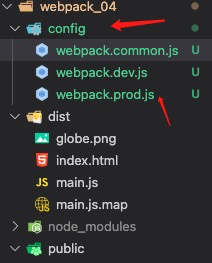
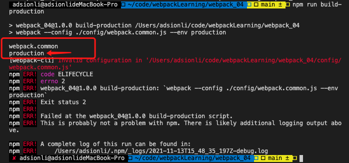

# webpack学习终章

| 文档创建人 | 创建日期   | 文档内容        | 更新时间   |
| ---------- | ---------- | --------------- | ---------- |
| adsionli   | 2021-11-12 | webpack学习终章 | 2021-11-12 |

> 经过一段时间断断续续的学习，webpack学习也已经进入了最后一章了，在这张学习结束之后，我将会去使用学习到的webpack知识，去完成本站的预渲染以及服务端渲染使用。后面也会整理出来，分享给大家踩坑经验。

## Typescript的配置

Typescript配置，首先需要确保全局安装了Typescript。

```shell
npm install -g typescript
//安装完成后，通过指令查看是否安装成功
tsc -v
//如果有显示信息，即为安装成功了。
```

ts安装完成之后，再来到项目中安装`ts-loader`，安装完之后，在对ts-loader进行配置。(**还需要在根目录创建一个tsconfig.json，可以是空的，这是现在`ts-loader`的要求**)

```shell
//安装typescript-loader
npm install -D ts-loader
```

配置

```js
module.exports = {
    module: {
        rules: [
            {
                test: /\.ts$/,
                use: ['ts-loader']
            }
        ]
    }
}
```

配置完成后，就可以在项目中使用typescript了。但是对于一些新的特性这时候还是无法在打包时候被解析，如`Promise, Symbol, Reflect`等。这个时候就需要使用`babel-loader`对typescript进行配置。

```js
module.exports = {
    module: {
        rules: [
            {
                test: /\.ts$/,
                use: ['babel-loader']
            }
        ]
    }
}
```

首先按照上述配置，使ts文件通过`babel-loader`进行`polyfill`填充，然后配置一下babel.config.js，添加`babel-preset-typescript`，用来使typescript下的`polyfill`填充。

```shell
npm install -D @babel/preset-typescript
```

```js
module.exports = {
	presets: [
		[
			'@babel/preset-env',
			{
				useBuiltIns: 'usage',
				corejs: 3
			}
		],
		[
			'@babel/preset-typescript'
		]
	]
}
```

通过上述配置，我们就可以使用`babel-loader`来对typescript进行`polyfill`的填充了。

假如我们现在有一段代码如下

```typescript
const name:string = 'adsionli';

function foo(name:string){
    console.log(name);
}

const p1 = new Promise((resolve, reject) => {
    
});

foo(123);
```

然后我们使用`npm run build`命令进行打包，查看一下输出文件(**这里我把mode设置为了development，devtool为cheap-module-source-map，这样方便查看**)中的呈现


我们可以看到我们故意使用的错误代码没有在打包的过程中被babel-loader识别出来，但是`Promise`的确被babel-loader的polyfill进行了填充，这就是babel-loader存在的问题。

那我们如果换成typescript-loader进行打包时，查看一下打包情况


上图我们就会发现ts-loader打包失败了，它检查出了我们在代码编写时候的错误。

那么我们应该怎么去融合ts-loader和babel-loader，让它在打包时，既能够查找出代码别写错误，也可以完成polyfill填充呢？

这里就有一个折中办法。首先我们去配置一下package.json，在package.json中新增一条指令。

```json
"scripts": {
    "test": "echo \"Error: no test specified\" && exit 1",
    "build": "webpack --config ./webpack.config.js",
    "serve": "webpack serve --config ./webpack.config.js",
    "start": "node ./serve.js",
    "judgeTs": "tsc --noEmit"
}
```

我们新增了一条检查ts语法是否正确的指令，然后我们运行一下看一下输出(这里的noEmit就是代表执行tsc之后，不对执行文件射出)


我们可以看见tsc可以查找出语法中存在的错误，那我们可以在改造一下build。

```json
"scripts": {
    "test": "echo \"Error: no test specified\" && exit 1",
    "build": "npm run judgeTs && webpack --config ./webpack.config.js",
    "serve": "webpack serve --config ./webpack.config.js",
    "start": "node ./serve.js",
    "judgeTs": "tsc --noEmit"
}
```

那么这时候再来执行以下`npm run build`指令，看一下输出效果。


现在我们可以发现打包失败了，因为在打包之前执行了tsc指令对语法进行了检查，出现错误就不继续执行打包操作了，这样就比较符合我们的要求了。接下来我们把代码改成正确的，看看是否可以打包成功。


ohhhh！打包成功了，这样就可以比较兼容的在webpack项目中使用babel-loader和typescipt了！

## 区分打包环境

在我们具体生产开发中，需要区分开是开发环境还是生产环境，那么我们需要对webpack.config.js进行区分，使其在打包的过程中，可以区分开是开发环境还是生产环境。

1. 首先我们需要调整一下项目的目录，创建一个config文件夹，并创建`webpack.common.js,webpack.dev.js,webpack.prod.js`。(不一定要一模一样，根据个人习惯来创建)

   `webpack.common.js`主要用来配置在production与development中都需要使用的配置项。

   `webpack.dev.js`用来配置开发环境中的webpack配置。

   `webpack.prod.js`用来配置生产环境中的webpack配置。

   

2. 修改一下package.json中的指令集，新增基于不同配置文件的打包指令

   ```json
   {
       "scripts": {
           "test": "echo \"Error: no test specified\" && exit 1",
           "build": "webpack --config ./config/webpack.common.js --env development",
           "build-production": "webpack --config ./config/webpack.common.js --env production",
           "serve": "webpack serve --config ./webpack.common.js --env development",
           "serve-production": "webpack serve --config ./webpack.common.js --env production server",
           "start": "node ./serve.js",
       }
   }
   ```

   > 这里会有一个env的命令参数，它可以传递参数给到webpack.common.js中，webpack.common.js根据传递来的参数来区分开发环境和生产环境。
   >
   > ```js
   > //先使用webpack.common.js来接收一下参数
   > module.exports = (env) => {
   >     if(env.production){
   >         console.log('production')
   >     }else{
   >         console.log('development')
   >     }
   > }
   > ```
   >
   > 查看一下控制台输出：
   >
   > 
   >
   > 我们看到是可以接收参数的。

这样就可以初步的完成`development`与`production`环境的区分了，接着就可以进行配置了。

## 合并生产环境配置

经过了上一步的开发环境与生产环境的区分之后，我们就可以针对不同的开发环境来做设置了。

1. 首先我们将公共配置放入到webpack.common.js，这样可以用来减少webpack.prod.js与webpack.dev.js中代码量。

   ```js
   const path = require('path')
   const HtmlWebpackPlugin = require('html-webpack-plugin')
   const { DefinePlugin } = require('webpack')
   
   module.exports = (env) => {
       if (env.production) {
           console.log('production')
       } else {
           console.log('development')
       }
   
       return {
           entry: './src/index.ts',
           output: {
               filename: 'main.js',
               path: path.resolve(__dirname, '../dist'),
           },
           optimization: {
               moduleIds: 'named'
           },
           resolve: {
               mainFiles: ['index', 'main'],
               extensions: ['.json', '.js', '.vue', '.scss', '.css'],
               modules: ['node_modules', 'src/modules'],
               alias: {
                   '@': path.resolve(__dirname, '../src')
               }
           },
           module: {
               rules: [
                   {
                       test: /\.css$/,
                       use: [
                           'style-loader',
                           {
                               loader: 'css-loader',
                               options: {
                                   importLoaders: 1,
                                   esModule: false
                               }
                           },
                           'postcss-loader'
                       ]
                   },
                   {
                       test: /\.scss$/,
                       use: [
                           'style-loader',
                           {
                               loader: 'css-loader',
                               options: {
                                   importLoaders: 1,
                                   esModule: false
                               }
                           },
                           'postcss-loader',
                           'sass-loader'
                       ]
                   },
                   {
                       test: /\.(jpe?g|git|png|svg)$/,
                       type: 'asset',
                       generator: {
                           filename: 'img/[name][hash:4].[ext]'
                       },
                       parser: {
                           dataUrlCondition: {
                               maxSize: 30 * 1024
                           }
                       }
                   },
                   {
                       test: /\.(ttf|woff2?)$/,
                       type: 'asset/resource',
                       generator: {
                           filename: 'font/[name][hash:4].[ext]'
                       }
                   },
                   {
                       test: /\.js$/,
                       exclude: /node_modules/,
                       use: [
                           {
                               loader: 'babel-loader',
                           }
                       ]
                   },
                   {
                       test: /\.vue$/,
                       use: ['vue-loader']
                   },
                   {
                       test: /\.ts$/,
                       use: ['ts-loader']
                   }
               ]
           },
           plugins: [
               new HtmlWebpackPlugin({
                   title: 'adsionli的webpack学习之路',
                   template: '../public/index.html'
               }),
               new DefinePlugin({
                   BASE_URL: '"../"'
               })
           ]
       }
   }
   ```

   这里我们就配置好了`webpack.common.js`了，但是细心的你们会发现，这里的文件路径为什么会那么奇怪，有的是`../`而有的是`./`，这样的相对路径为什么会有一些不同呢？

   因为在entry中，它的路径读取的是package.json中进行build的时传入的那个路径，所以他的相对路径还是基于根目录下的，但是resolve和output中的路径就是基于当前文件上下文config文件夹下的相对路径了。

   这里可以参考相关的前端脚手架工具的解决方式，在config文件夹下创建一个path.js。然后编写path.js文件的代码

   ```js
   const path = require('path');
   //这里是使用了nodejs中一个内置对象，可以获取到当前执行终端的位置。
   const appDir = process.cwd();
   
   const resolveApp = (relativePath) => {
       return path.resolve(appDir, relativePath);
   }
   
   module.exports = resolveApp
   ```

   这时候再把webpack.common.js中涉及到路径的进行替换就可以了。

   ```js
   const HtmlWebpackPlugin = require('html-webpack-plugin')
   const { DefinePlugin } = require('webpack')
   const resolveApp = require('./path.js')
   
   module.exports = (env) => {
       if (env.production) {
           console.log('production')
       } else {
           console.log('development')
       }
   	//内容太多，就设置一下修改的内容
       return {
           entry: './src/index.ts',
           output: {
               filename: 'main.js',
               path: resolveApp('./dist'),
           },
           resolve: {
               mainFiles: ['index', 'main'],
               extensions: ['.json', '.js', '.vue', '.scss', '.css'],
               modules: ['node_modules', 'src/modules'],
               alias: {
                   '@': resolveApp('./src')
               }
           }
       }
   }
   ```

   这样就解决了路径的问题了

2. 配置`webpack.dev.js`与`webpack.prod.js`

   首先是对webpack.prod.js的配置，在这个配置中我们需要竟可能的简化最后的打包输出项，所以我们不需要source-map等内容。

   ```js
   const { CleanWebpackPlugin } = require('clean-webpack-plugin');
   const CopyPlugin = require('copy-webpack-plugin')
   
   module.exports = {
       mode: 'production',
       plugins: [
           new CleanWebpackPlugin({
               verbose: true,
               CleanStaleWebPackageAssets: true
           }),
           new CopyPlugin({
               patterns: [
                   {
                       from: 'public',
                       globOptions: {
                           ignore: [
                               '**/index.html'
                           ]
                       }
                   }
               ]
           })
       ]
   }
   ```

   接下来是webpack.dev.js的配置，这个配置使用在开发环境下，所以我们需要将相关辅助工具都加入进来。

   ```js
   const { CleanWebpackPlugin } = require('clean-webpack-plugin');
   const { DefinePlugin } = require('webpack')
   const CopyPlugin = require('copy-webpack-plugin')
   const webpack = require('webpack')
   module.exports = {
       mode: 'development',
       devtool: 'cheap-module-source-map',
       target: "web",
       //如果开启在node api中，这里就不要配置devServer，将配置写在启动Node服务的地方
       devServer: {
           hot: true,
           hotOnly: true,
           port: 8888,
           host: '0.0.0.0',
           //默认为false，需要自己开启
           watchContentBase: true,
           compress: true,
           historyApiFallback: true
       },
       optimization: {
           moduleIds: 'named'
       },
       plugins: [
           new CleanWebpackPlugin({
               verbose: true,
               CleanStaleWebPackageAssets: true
           }),
           new DefinePlugin({
               BASE_URL: '"./"'
           }),
           new CopyPlugin({
               patterns: [
                   {
                       from: 'public',
                       globOptions: {
                           ignore: [
                               '**/index.html'
                           ]
                       }
                   }
               ]
           }),
           new webpack.HotModuleReplacementPlugin()
       ]
   }
   ```

3. 完成上述两个文件的配置之后，我们还需要一个webpack-merge的库，来将commonConfig与打包环境筛选后的config进行融合，最终输出的就是我们所需要的内容。

   ```js
   const {merge} = require('webpack-merge');
   const commonConfig = {...};
   const prodConfig = require('./webpack.prod');
   const devConfig = require('./webpack.dev');
   
   module.exports = (...env) => {
        const mergeConfig = merge(commonConfig, env.production ? prodConfig : devConfig);
        return mergeConfig;
   }
   ```

   完成上述代码的编写之后，我们就完成了生产环境与开发环境的完全分离，这样非常有利于我们管理两个环境所需要的不同内容，可以有效的控制项目的内容。


# 总结

陆陆续续学了大概小半个月的webpack的使用，平时的事情有点多，也不能很好地连续的学习。但是通过这段时间的webpack的学习，让我收获巨大，让自己对vue-cli打包的流程已经其热更新原理还有vue-router的大概工作原理都有了比较清楚的认知，让我感到十分开心，不会再对其工作流程感到困惑。还望继续加油，投入更多的时间到学习中来，加油加油，为明年校招继续努力！

