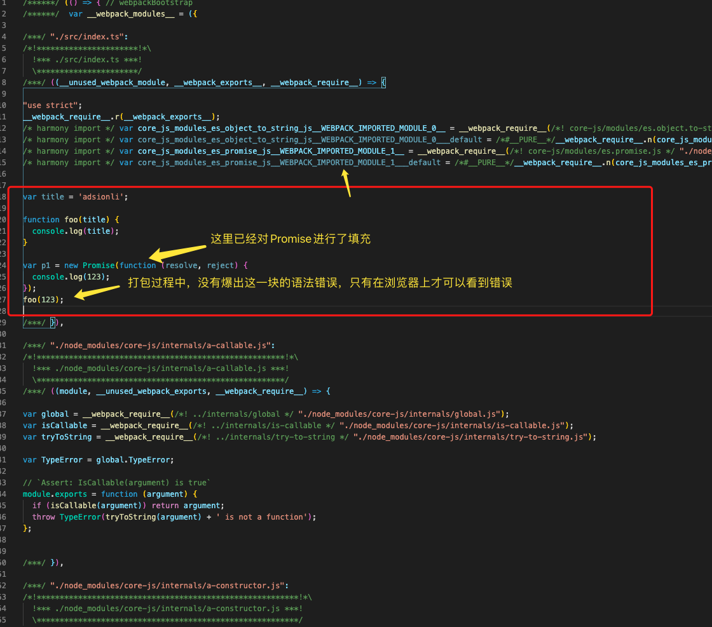
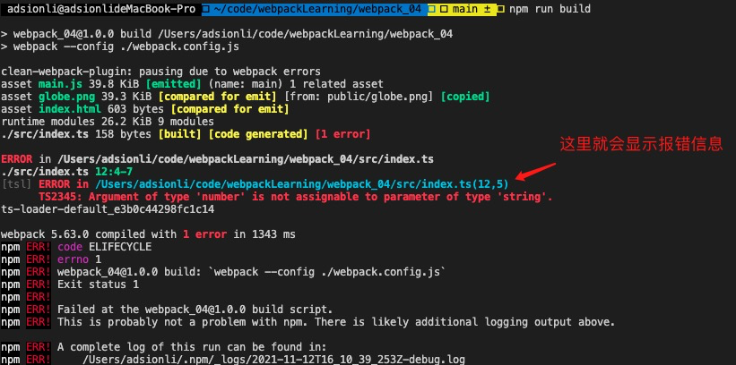
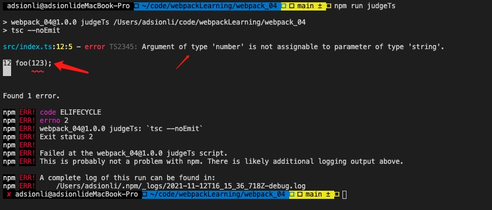
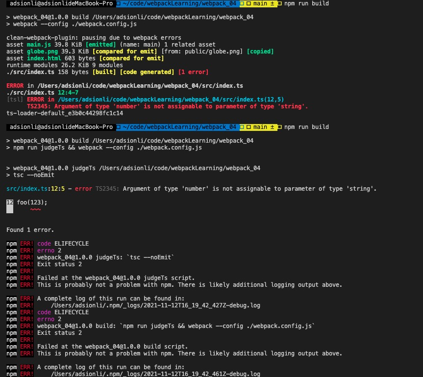
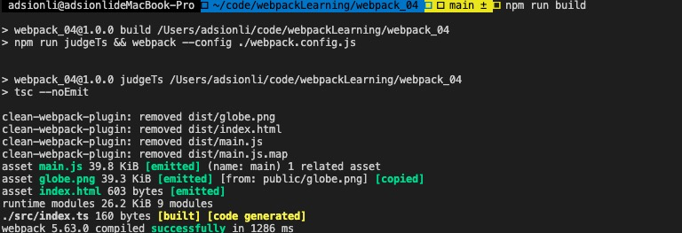

# webpack学习终章

| 文档创建人 | 创建日期   | 文档内容        | 更新时间   |
| ---------- | ---------- | --------------- | ---------- |
| adsionli   | 2021-11-12 | webpack学习终章 | 2021-11-12 |

> 经过一段时间断断续续的学习，webpack学习也已经进入了最后一章了，在这张学习结束之后，我将会去使用学习到的webpack知识，去完成本站的预渲染以及服务端渲染使用。后面也会整理出来，分享给大家踩坑经验。

## Typescript的配置

Typescript配置，首先需要确保全局安装了Typescript。

```shell
npm install -g typescript
//安装完成后，通过指令查看是否安装成功
tsc -v
//如果有显示信息，即为安装成功了。
```

ts安装完成之后，再来到项目中安装`ts-loader`，安装完之后，在对ts-loader进行配置。(**还需要在根目录创建一个tsconfig.json，可以是空的，这是现在`ts-loader`的要求**)

```shell
//安装typescript-loader
npm install -D ts-loader
```

配置

```js
module.exports = {
    module: {
        rules: [
            {
                test: /\.ts$/,
                use: ['ts-loader']
            }
        ]
    }
}
```

配置完成后，就可以在项目中使用typescript了。但是对于一些新的特性这时候还是无法在打包时候被解析，如`Promise, Symbol, Reflect`等。这个时候就需要使用`babel-loader`对typescript进行配置。

```js
module.exports = {
    module: {
        rules: [
            {
                test: /\.ts$/,
                use: ['babel-loader']
            }
        ]
    }
}
```

首先按照上述配置，使ts文件通过`babel-loader`进行`polyfill`填充，然后配置一下babel.config.js，添加`babel-preset-typescript`，用来使typescript下的`polyfill`填充。

```shell
npm install -D @babel/preset-typescript
```

```js
module.exports = {
	presets: [
		[
			'@babel/preset-env',
			{
				useBuiltIns: 'usage',
				corejs: 3
			}
		],
		[
			'@babel/preset-typescript'
		]
	]
}
```

通过上述配置，我们就可以使用`babel-loader`来对typescript进行`polyfill`的填充了。

假如我们现在有一段代码如下

```typescript
const name:string = 'adsionli';

function foo(name:string){
    console.log(name);
}

const p1 = new Promise((resolve, reject) => {
    
});

foo(123);
```

然后我们使用`npm run build`命令进行打包，查看一下输出文件(**这里我把mode设置为了development，devtool为cheap-module-source-map，这样方便查看**)中的呈现



我们可以看到我们故意使用的错误代码没有在打包的过程中被babel-loader识别出来，但是`Promise`的确被babel-loader的polyfill进行了填充，这就是babel-loader存在的问题。

那我们如果换成typescript-loader进行打包时，查看一下打包情况



上图我们就会发现ts-loader打包失败了，它检查出了我们在代码编写时候的错误。

那么我们应该怎么去融合ts-loader和babel-loader，让它在打包时，既能够查找出代码别写错误，也可以完成polyfill填充呢？

这里就有一个折中办法。首先我们去配置一下package.json，在package.json中新增一条指令。

```json
"scripts": {
    "test": "echo \"Error: no test specified\" && exit 1",
    "build": "webpack --config ./webpack.config.js",
    "serve": "webpack serve --config ./webpack.config.js",
    "start": "node ./serve.js",
    "judgeTs": "tsc --noEmit"
}
```

我们新增了一条检查ts语法是否正确的指令，然后我们运行一下看一下输出(这里的noEmit就是代表执行tsc之后，不对执行文件射出)



我们可以看见tsc可以查找出语法中存在的错误，那我们可以在改造一下build。

```json
"scripts": {
    "test": "echo \"Error: no test specified\" && exit 1",
    "build": "npm run judgeTs && webpack --config ./webpack.config.js",
    "serve": "webpack serve --config ./webpack.config.js",
    "start": "node ./serve.js",
    "judgeTs": "tsc --noEmit"
}
```

那么这时候再来执行以下`npm run build`指令，看一下输出效果。



现在我们可以发现打包失败了，因为在打包之前执行了tsc指令对语法进行了检查，出现错误就不继续执行打包操作了，这样就比较符合我们的要求了。接下来我们把代码改成正确的，看看是否可以打包成功。



ohhhh！打包成功了，这样就可以比较兼容的在webpack项目中使用babel-loader和typescipt了！

## vue文件的加载


## 区分打包环境


## 合并生产环境配置