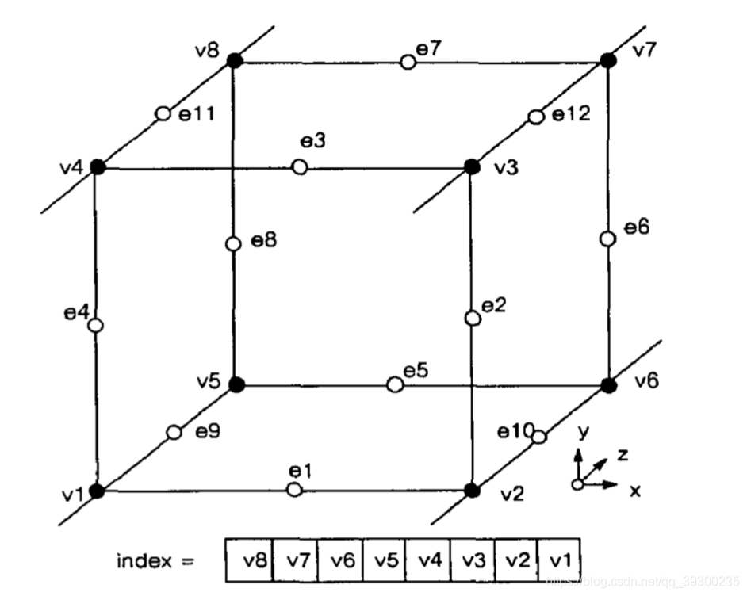

# Marching-Cube

| 文档创建人 | 创建日期   | 文档内容                    | 更新时间 |
| ---------- | ---------- | --------------------------- | -------- |
| adsionli   | 2022-11-15 | Marching-Cube代码阅读及复现 |          |

因为需要对比实验，所以需要使用Marching-Cube来重建云粒子的表面，来对比速率，所以就看一下师兄的博客，来对Marching-Cube表面重建进行学习及代码阅读与理解，最后插入到自己的代码中。

## Marching-Cube基本概念

Marching Cube算法，最早是Lorensen等人在“Marching cubes: A high resolution 3D surface construction algorithm”这篇文章中提出的算法，他们最早是用来实现医学图像的三维重建，现在该算法可以用于任何基于标量场的表面重建，并还有许多优化版本。本文就提一下它的最初版本。
给空间划分为了许多小网格，**每个网格也称为体元（cell）**，如下图所示：

由于该算法是基于标量场的，所以我们需要知道**网格点是在场外还是场内（表面外还是表面内**），即**f(x,y,z)=0的点为表面点，所以也称点(x,y,z)满足该隐函数**。由于每个体元上有八个顶点。若**连续的两个顶点**，有一个顶点位于表面**外**，另一个顶点位于表面**内**，则我们的**表面就肯定位于这两个顶点之间**，即可以**用加权插值获得最后表面的位置**。因此我们的算法需要**遍历所有的网格**，判断网格的**每个顶点是在表面外还是表面内**，若为**表面内则赋值1**，否则**赋值0**。

Lorensen等人他们就发现了每个网格一共就8个顶点，那所有的可能性就只有=256种。并且由于立方体具有旋转对称性，经过一定的旋转会得到同样的值，因此他们经过归纳发现所有情况可以归结为以下15种：

 之后给每个立方体定义了一个固定的顶点编号和边编号：

如图所示，v为顶点编号e为边编号。因为正好是八个顶点，就可以利用一个char类型（8位）来保存该编号索引。由于我们最后的三角片面的顶点都会在边上，立方体有12条边，所以我们可以用一个12位2进制数表示边是否含有三角片面的点。因为我们构建的三角形片面情况一共只有256种，所以我们可以建立边索引表。如我们顶点索引位00000001，说明只有v1在表面内，因此说明表面的顶点在e1，e4，e9上，则边索引为001000001001，化为16进制为0x109。以顶点的八位二进制值为边表索引，以对应的12位二进制值为边表值，则上述例子可表示为边表索引为1的值为0x109。然后对256种情况一一对应即可构造出边表。
