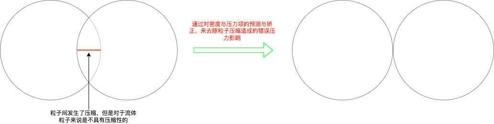

# PCISPH

| 文档创建人 | 创建日期   | 文档内容                 | 更新时间   |
| ---------- | ---------- | ------------------------ | ---------- |
| adsionli   | 2022.04.26 | PCISPH论文学习与代码复现 | 2022.04.26 |

PCISPH是被用来解决流体粒子间不可压缩性的问题的。

在一定的时间步长内，用标准的SPH方法求解，在在粒子聚集处容易发生挤压，造成压缩。这样就会产生一个不符合流体运动的压力，而PCISPH方法的提出解决了这个问题，通过预测矫正(对流体密度和压力的矫正)，来使粒子达到不可压缩性，而且PCISPH的性能也相对高效，允许更大的时间步长。

图示说明：

## PCISPH模型

### SPH使用到的内容

> SPH方法使用离散化的粒子来表示连续的场，所以需要对每一个粒子都要进行计算

1. **第i个粒子的密度**

$$
\rho(r_i) = \sum_{j} {m_j} W((\overrightarrow{r_i} - \overrightarrow{r_j}) \cdot h)
$$

​	其中$W((\overrightarrow{r_i} - \overrightarrow{r_j}) \cdot h)$在SPH流体中的计算模型如下:
$$
W_{poly6}(\overrightarrow{r}, h ) = 
\begin{cases}
K_{poly6}(h^2 - r^2)^3 & 0 \leq r \leq h \\
0  & otherwise \\
\end{cases}
$$
​	$K_{poly6}$我们可以在进行代码书写的时候预计算出来，其计算模型如下：
$$
K_{poly6} = 
\begin{cases}
\frac{1}{\int_{0}^{2\pi}\int_{0}^{h}{r(h^2 - r^2)^3 drd\theta}} = \frac{4}{\pi h^8} & 2d \\
\frac{1}{\int_{0}^{2\pi}\int_{0}^{\pi}\int_{0}^{h}{r^2\sin(\psi)(h^2 - r^2)^3 d\psi dr d\theta}} = \frac{315}{64\pi h^9} & 3d \\
\end{cases}
$$

> 这里写的比较全，是为了之后在代码模块中实现的时候，方便查看，不需要再去查看SPH里的模型描述了
>
> 一些变量的说明与内容相关说明：
>
> 1. $r$实际上是$\begin{Vmatrix} \overrightarrow{r_i} - \overrightarrow{r_j} \end{Vmatrix}$的标识，代表两个粒子间的距离间距。
> 2. $h$代表的就是我们自己设置的光滑核半径大小。
> 3. 只有在粒子间距小于光滑核半径的时候，说明粒子挤压在一起了，这个时候粒子就压缩了，所以密度发生改变
> 4. 还有关于拉普拉斯算子和哈密顿算子的相关知识，可以看我师兄写的[拉普拉斯算子与哈密顿算子](https://blog.csdn.net/qq_39300235/article/details/100982901?spm=1001.2014.3001.5502)

​	有了上面的几个模型准备后，我们可以得出最后的每个粒子密度的方程:
$$
\rho(r_i) = m \frac{315}{64\pi h^9} \sum_{j} {(h^2 - r^2)^3}
$$

2. **第i个粒子的压力**

有了上面的密度模型之后，我们可以通过Navier-Stokes方程中推得压力方程，下面是Navier-Stokes方程的模型
$$
\frac{d\rho_i}{dt}=-\rho\nabla v
$$

$$
\rho_i \frac{dv_i}{dt} = -\nabla \rho_i + \rho_ig+ \mu \nabla^2v_i
$$

​	结合密度方程，推出每个粒子的压力方程:
$$
F^p_i = -m^2 \sum_{j}{(\frac{p_i}{\rho_i^2} + \frac{p_j}{\rho_j^2}) \cdot \nabla W(x_{ij}, h)}
$$
​	

3. **第i个粒子的粘性力**